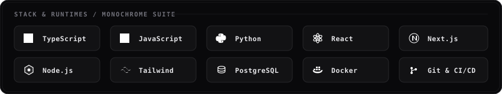

<div align="center">

  <!-- Minimalist Monochrome Animated Header Banner -->
  <a href="https://github.com/opsihab660">
    
  </a>

  <br/><br/>

  <!-- Clean Monochromatic Status Badges -->
  <p align="center">
    
    
    
  </p>

  <!-- Connect Channels -->
  <p align="center">
    <a href="mailto:ms.sihab.543@gmail.com">
      
    </a>
    <a href="https://github.com/opsihab660">
      
    </a>
    <a href="https://linkedin.com">
      
    </a>
  </p>

</div>

---

### Executive Profile

```yaml
Architect: Md Sihab Hossen
Location: Bangladesh
Discipline: Full-Stack Engineering & Scalable Backend Architectures
Core_Stack: TypeScript, Next.js, Node.js, Python, PostgreSQL, Distributed APIs
Current_Focus: Privacy-Centric Analytics & Autonomous Agent Frameworks
Standard: High performance, zero-bloat, clean design systems
```

- **DayLens**: Privacy-centric Windows desktop activity and learning analytics tool.
- **Bodh Agent**: Autonomous AI agent architecture with custom task-orchestration loops.
- **MovieBox API v2**: High-throughput media streaming and metadata extraction engine.

---

### Animated Stack & Runtimes

<div align="center">
  
</div>

<br/>

<div align="center">
  
</div>

---

### Selected Engineering Work

| Initiative | Architecture & Scope | Stack | Reference |
| :--- | :--- | :--- | :---: |
| **DayLens** | Privacy-first activity tracking with local storage & real-time analytics. | `JavaScript` `Node.js` `SQLite` | [View Code](https://github.com/opsihab660/daylens) |
| **Bodh Agent** | Autonomous multi-step task execution agent and workflow scheduler. | `JavaScript` `Node.js` `AI` | [View Code](https://github.com/opsihab660/bodh-agent) |
| **MovieBox API v2** | Low-latency REST API service with caching and resilient streaming scrapers. | `Python` `FastAPI` `REST` | [View Code](https://github.com/opsihab660/moviebox-v2-api) |
| **Bot Dashboard** | Web control plane for managing real-time webhook automations and bots. | `React` `JavaScript` `APIs` | [View Code](https://github.com/opsihab660/fb-messenger-bot-dashboard) |
| **Anime Dekho** | Reactive streaming interface with modern caching and responsive layout. | `TypeScript` `React` `Tailwind` | [View Code](https://github.com/opsihab660/anime-dekho) |

---

### Telemetry & Analytics

<div align="center">

  <table border="0">
    <tr>
      <td>
        
      </td>
      <td>
        
      </td>
    </tr>
  </table>

  <br/>

  

</div>

---

<div align="center">

  <sub>Crafted with discipline and clean architecture. Available for select engineering contracts.</sub>

  <br/><br/>

  <a href="mailto:ms.sihab.543@gmail.com">
    
  </a>

</div>
